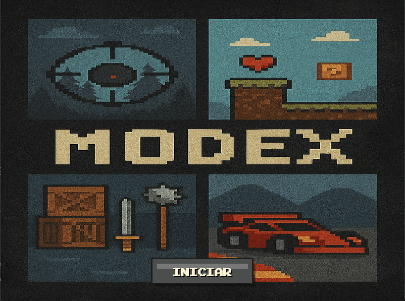

[](README.es.md)

# 🎮 ModeX Arcade


A **modular arcade system** developed in Python using the Pygame and Arcade libraries. ModeX integrates four 2D games with different mechanics into a single standalone executable, validating that Python can achieve stable 60 FPS on conventional hardware without commercial engines.

---

## 🎬 Preview

<div align="center">
  
</div>

---

## 👨‍💻 Team Information

| Role | Name | Email |
|------|------|-------|
| Developer & Researcher | Magallanes López Carlos Gabriel | cgmagallanes23@gmail.com |
| Developer & Researcher | Barrón Pando Kevin Zaid | — |

---

## 🎯 Project Description

ModeX Arcade is a **technology research project** that answers one central question:

> *Is it technically feasible to develop professional-quality 2D games in Python with open-source libraries, achieving stable 60 FPS on conventional hardware?*

The answer, backed by data from 75 playtesting sessions, is **yes**.

The system integrates four games across different genres — racing, platformer, fighting, and co-op shooter — all sharing a common modular architecture, an automatic performance measurement system, and a standalone executable that requires no Python installation.

---

## 🕹️ Games

| Game | Genre | Library |
|------|-------|---------|
| 🏎️ **Neon Rush** | Top-down racing | Arcade |
| 🌌 **Cosmic Odyssey** | 2D platformer | Arcade |
| ⚔️ **The Ghost Tsushima** | 1v1 fighting | Pygame |
| 🧟 **The Past Z** | Co-op zombie shooter | Pygame |

---

## 📊 Performance Results

Results from **75 playtesting sessions** (25 per game) on an Intel Core i5-8th gen., 8 GB RAM, Intel UHD 630:

| Game | Avg FPS | Median FPS | Std Dev | Frame Drops |
|------|---------|------------|---------|-------------|
| Fight | **60.41** | 60.45 | 0.75 | 0.00% |
| Platformer | **58.75** | 58.79 | 1.05 | 0.21% |
| Racing | **58.10** | 58.10 | 1.20 | 2.90%* |

> \*Racing drops are exclusively from synchronous level-transition loading spikes (~2,237 ms and ~2,791 ms). The median in normal conditions is 58.10 FPS.

**Memory:** Constant 50 MB RAM across all games and sessions. **0 memory leaks detected.**

---

## 🔧 Architecture & Optimizations

```
ModeXArcade/
├── main.py                  ← Entry point
├── utils/
│   ├── singleton.py         ← Singleton metaclass
│   ├── paths.py             ← Absolute path resolution
│   └── colors.py            ← Color constants
├── games/
│   ├── neon_rush/           ← Racing game (Arcade)
│   ├── cosmic_odyssey/      ← Platformer (Arcade)
│   ├── ghost_tsushima/      ← Fighting game (Pygame)
│   └── the_past_z/          ← Shooter (Pygame)
├── assets/                  ← Shared assets
└── state/                   ← SQLite persistence
```

### Key optimizations applied
- **Object pooling** — Reuse of bullet and particle instances
- **Sprite batching** — Grouping draw calls to reduce GPU trips
- **Spatial culling** — Skip update/render of off-viewport entities
- **Spatial hashing** — Avoid redundant collision calculations for static objects
- **`__slots__`** — Fixed-size attribute storage eliminating per-instance dict overhead
- **`functools.lru_cache`** — Memoization for expensive recursive functions

---

## 🏆 Contest Results

| Contest | Date | Version | Result |
|---------|------|---------|--------|
| Local Prototype Contest (DGETI) | Nov 25–26, 2025 | v1.2 | 🥈 2nd Place — Software |
| State Contest 26-AS3414 | Mar 11–13, 2026 | v1.5 | 🥉 3rd Place — Software |
| TecMilenio Hackathon | Apr 22, 2026 | v1.6 | 🥉 3rd Place — STEAM |

---

## 🧪 Methodology

The research follows an adapted **RAD (Rapid Application Development)** methodology with 2-week iterative cycles. The data collection design is **quantitative evaluative-experimental**.

### Metrics collected per session (every 2 seconds, automatically)
- Instantaneous / average / historical minimum FPS
- FPS 1st and 99th percentiles
- FPS standard deviation
- Frame time (ms)
- RAM consumption
- Garbage collector (GC) data
- Active entity count
- Estimated draw calls
- Consecutive frame drop frequency

---

## 💡 Value Proposition

| Aspect | ModeX | Unity | Unreal Engine |
|--------|-------|-------|---------------|
| Software cost | **$0 MXN** | License required | License required |
| RAM requirement | **8 GB** | 8 GB (min) | 32 GB (recommended) |
| Install size | **250 MB** | Several GB | Several GB |
| Learning curve | Low (Python) | Medium–High | High |
| Replicability | Full documentation | Limited | Limited |

---

## 🛠️ Tech Stack

| Technology | Version | Purpose |
|------------|---------|---------|
| Python | 3.11.4 | Base language |
| Pygame | 2.6.1 | Fighting & Shooter games |
| Arcade | 3.3.2 | Racing & Platformer games |
| Tiled Map Editor | — | Level design (TMX) |
| SQLite | Built-in | Score and state persistence |
| PyInstaller | — | Standalone .exe packaging |
| Pytest | — | Unit testing |

---

## ⚙️ System Requirements

| Component | Minimum |
|-----------|---------|
| Processor | Intel Core i5 (8th gen.) or equivalent |
| RAM | 8 GB |
| Graphics | Intel UHD 620/630 or equivalent integrated GPU |
| Storage | 250 MB |
| OS | Windows 10 / 11 |

---

## ▶️ How to Run

```bash
# Download the latest release
# Run directly — no Python installation required
ModeX_Arcade_v1.6.exe
```
---

## 📚 Documentation

All documents are available on the [project website](https://modex-arcade-26-as3414.netlify.app/).

| Document | Description |
|----------|-------------|
| 📊 Research Document | 75-session performance analysis and hypothesis validation |
| 🔧 Technical Documentation | System architecture, design patterns, UML diagrams (26 pages) |
| 📖 User Manual | Complete gameplay guide and controls |
| ⚙️ Installation Manual | Setup, requirements, and troubleshooting |
| 📓 Binnacle | Chronological development log |

---

## 📈 Development Timeline

```
Feb 2025  → Algorithms, flowcharts and C++ foundations
Apr 2025  → Zhyniria: first game (C++, class project)
Sep 2025  → ModeX v1.0: Singleton, logging, utils, Neon Rush
Oct 2025  → ModeX v1.1: Cosmic Odyssey, The Ghost Tsushima
Nov 2025  → ModeX v1.2: The Past Z, first .bat executable
Nov 2025  → 🥈 Local Contest: 2nd Place
Dec 2025  → ModeX v1.3: SQLite, redesigned views, resizable window
Jan 2026  → ModeX v1.4: Global performance optimizations
Feb 2026  → ModeX v1.5: 75 playtesting sessions, .exe, full docs
Mar 2026  → 🥉 State Contest: 3rd Place
Apr 2026  → ModeX v1.6 → 🥉 TecMilenio Hackathon: 3rd Place STEAM
```

---

## 🔗 Links

- 🌐 **Website:** [thenarratorvimmxx.github.io/ModeXArcade](https://modex-arcade-26-as3414.netlify.app/)
- 📦 **Releases:** [github.com/TheNarratorVIMMXX/ModeXArcade/releases](https://github.com/TheNarratorVIMMXX/ModeXArcade/releases)
- 📧 **Contact:** cgmagallanes23@gmail.com

---

⭐ **A modular Python arcade system that proves interpreted languages can achieve professional-quality 2D game performance without commercial engines.**
